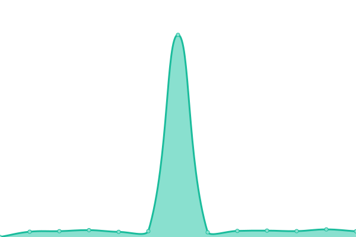
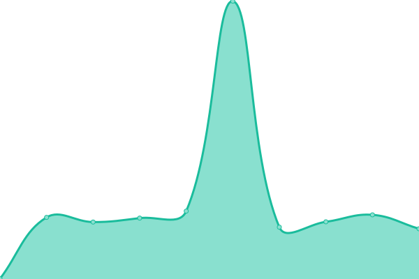

# [📈 Live Status](https://d1vanloon.github.io/family-uptime): <!--live status--> **🟧 Partial outage**

This repository contains the open-source uptime monitor and status page for [David Van Loon](https://davl.ink/me), powered by [Upptime](https://github.com/upptime/upptime).

With [Upptime](https://upptime.js.org), you can get your own unlimited and free uptime monitor and status page, powered entirely by a GitHub repository. We use [Issues](https://github.com/d1vanloon/family-uptime/issues) as incident reports, [Actions](https://github.com/d1vanloon/family-uptime/actions) as uptime monitors, and [Pages](https://d1vanloon.github.io/family-uptime) for the status page.

<!--start: status pages-->
<!-- This summary is generated by Upptime (https://github.com/upptime/upptime) -->
<!-- Do not edit this manually, your changes will be overwritten -->
<!-- prettier-ignore -->
| URL | Status | History | Response Time | Uptime |
| --- | ------ | ------- | ------------- | ------ |
|  [SCARIF](https://scarif.vanloon.family/) | 🟩 Up | [scarif.yml](https://github.com/d1vanloon/family-uptime/commits/HEAD/history/scarif.yml) | 

 766ms
     
 | 

<a href="https://status.vanloon.family/history/scarif">100.00%</a>
    

|  [Plex](https://plex.vanloon.family/web/index.html) | 🟥 Down | [plex.yml](https://github.com/d1vanloon/family-uptime/commits/HEAD/history/plex.yml) | 

 269ms
     
 | 

<a href="https://status.vanloon.family/history/plex">100.00%</a>
    

|  [VLTV](https://live.vanloon.family/) | 🟥 Down | [vltv.yml](https://github.com/d1vanloon/family-uptime/commits/HEAD/history/vltv.yml) | 

 260ms
     
 | 

<a href="https://status.vanloon.family/history/vltv">100.00%</a>
    

|  [S3](https://s3.vanloon.family/minio/login/) | 🟩 Up | [s3.yml](https://github.com/d1vanloon/family-uptime/commits/HEAD/history/s3.yml) | 

 249ms
     
 | 

<a href="https://status.vanloon.family/history/s3">100.00%</a>
    

|  [Streaming Ingest](https://ingest.vanloon.family/) | 🟥 Down | [streaming-ingest.yml](https://github.com/d1vanloon/family-uptime/commits/HEAD/history/streaming-ingest.yml) | 

 287ms
     
 | 

<a href="https://status.vanloon.family/history/streaming-ingest">100.00%</a>
    

|  [Media Requests](https://requests.vanloon.family/) | 🟥 Down | [media-requests.yml](https://github.com/d1vanloon/family-uptime/commits/HEAD/history/media-requests.yml) | 

 480ms
     
 | 

<a href="https://status.vanloon.family/history/media-requests">100.00%</a>
    

|  [MovieMatch](https://moviematch.vanloon.family/) | 🟥 Down | [movie-match.yml](https://github.com/d1vanloon/family-uptime/commits/HEAD/history/movie-match.yml) | 

 219ms
     
 | 

<a href="https://status.vanloon.family/history/movie-match">100.00%</a>
    

<!--end: status pages-->

[**Visit our status website →**](https://d1vanloon.github.io/family-uptime)

## 📄 License

- Powered by: [Upptime](https://github.com/upptime/upptime)
- Code: [MIT](./LICENSE) © [David Van Loon](https://davl.ink/me)
- Data in the `./history` directory: [Open Database License](https://opendatacommons.org/licenses/odbl/1-0/)
